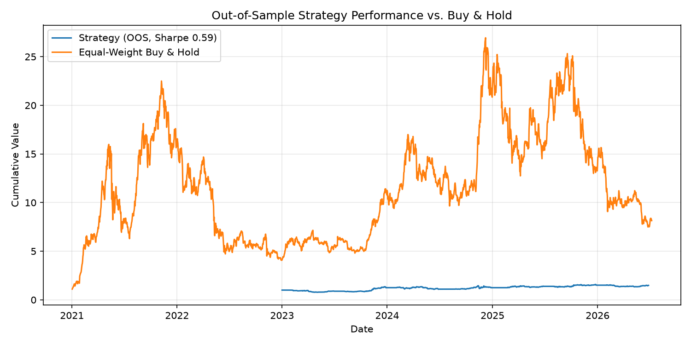

# Cross-Sectional Momentum Backtester


A crypto and equities momentum strategy, backtested with real risk controls and validated out-of-sample — built to answer one question honestly: does this edge actually exist, or did I just find a good-looking number by accident?

**Key finding:** an in-sample parameter sweep found Sharpe 1.55. Rolling walk-forward validation across 7 windows (2021–2024) showed the real out-of-sample Sharpe averages 0.50, with high variance across regimes. Full writeup: [NOTES.md](NOTES.md).



## What it does

Ranks a universe of assets by trailing momentum, goes long the winners and short the losers, resizes each position by inverse volatility, caps gross exposure at 100%, and force-liquidates any position that blows past a daily loss threshold.

## Architecture
engine/       — shared backtest machinery (data, costs, P&L, metrics)
strategies/   — the actual signal (momentum.py)
research/     — sweep, walk-forward validation, cross-asset testing, NOTES.md
main.py       — runs the full pipeline

## Running it

```bash
python3 -m venv venv
source venv/bin/activate
pip install -r requirements.txt
python3 main.py
```

## Methodology

- No lookahead bias — every signal uses only data available as of the prior day's close
- Costs are real — turnover-based transaction costs, not gross returns
- Sharpe annualized correctly per asset class (√365 crypto, √252 equities)
- Parameters are validated out-of-sample, not just picked off a full-history sweep

## Built with

Python · pandas · NumPy · yfinance